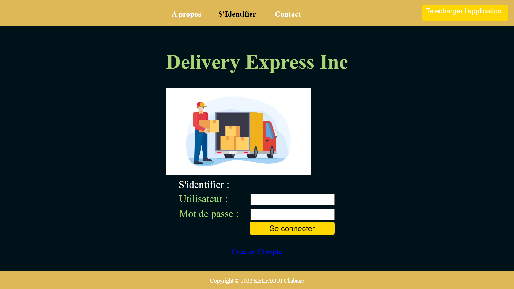

# colis-Project

##### Conception et réalisation d’une application web de gestion et suivi des colis (Tracking). Pour les sociétés spécialisées dans les services postaux, de livraison de colis et transport express.
#### langages utilisés: React JS , HTML , CSS (FRONT END) / node JS , Express js , MySQL (BACK END)
